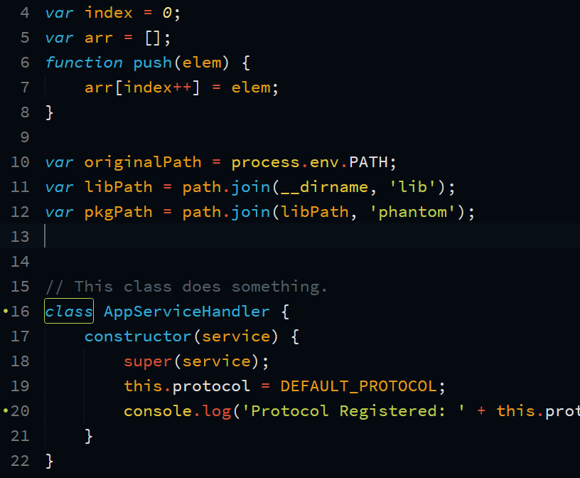
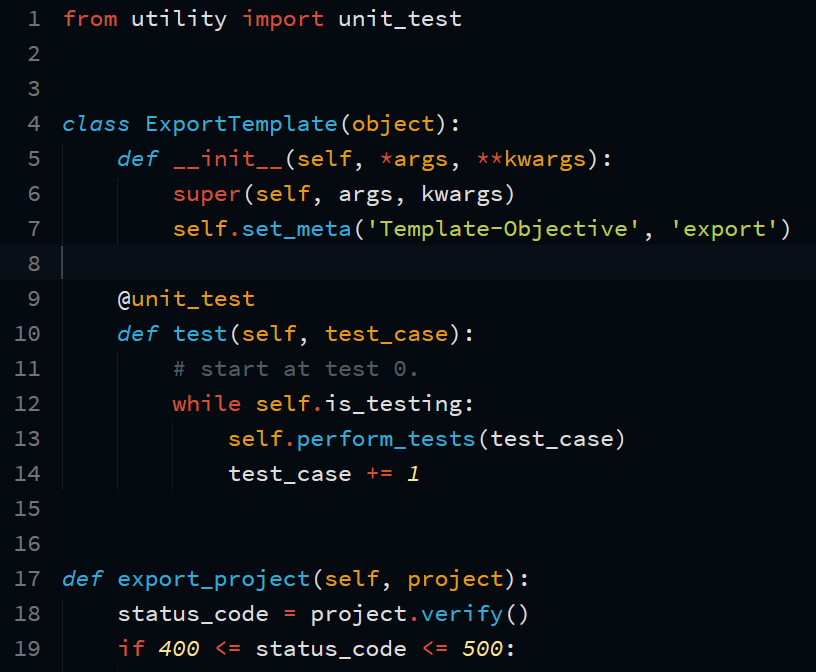

# FosterNeka colorscheme

A dark syntax theme for Sublime Text 3

\* support for other editors pending

Supports
- Sublime Text 3
- Atom (pending)
- Vim (pending)

** This is a port of neka because I don't vibe with their releases anymore. **